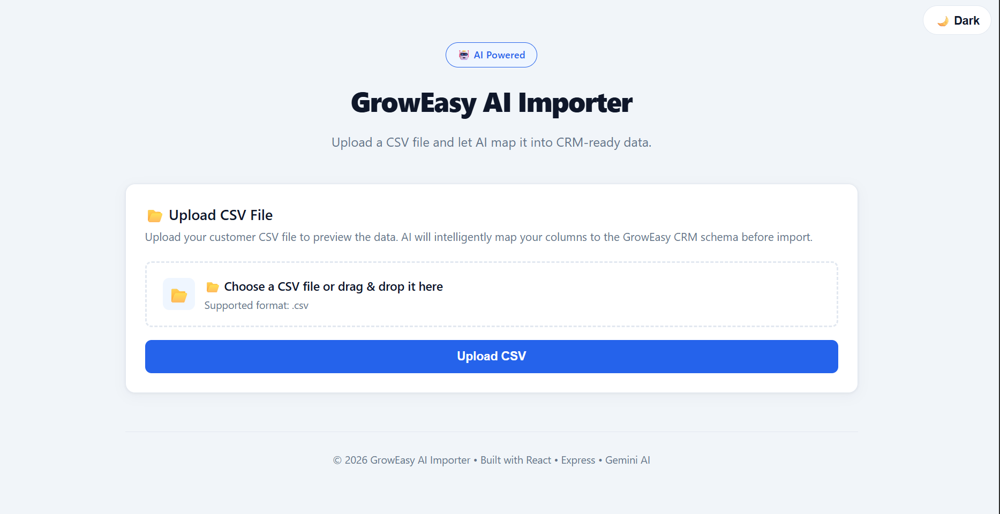
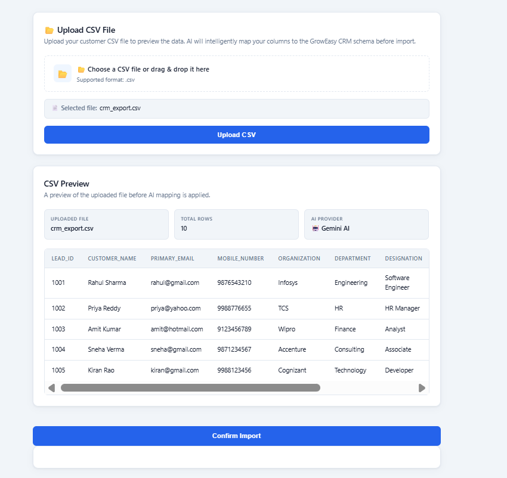
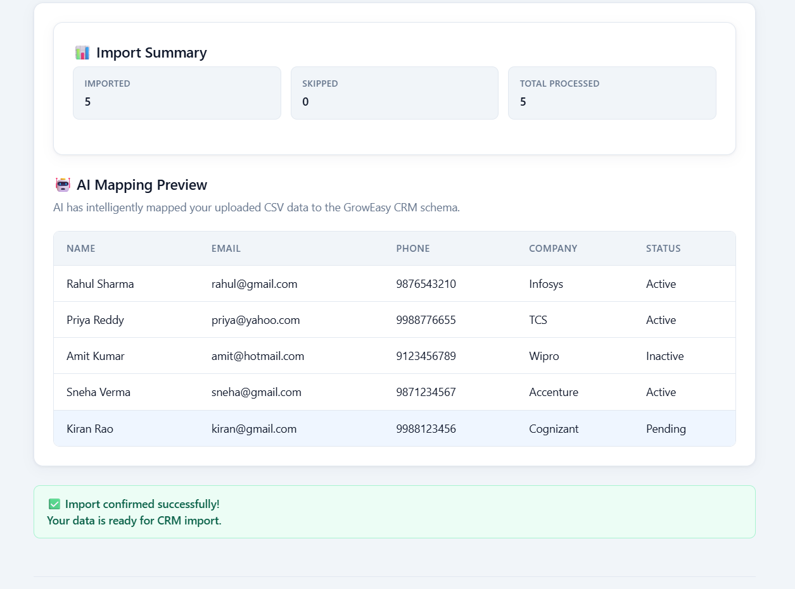
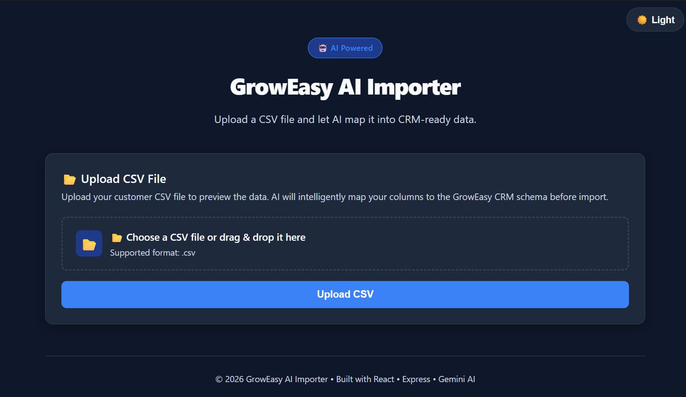

# 🚀 GrowEasy AI Importer

An AI-powered CSV Importer that intelligently maps uploaded customer data into a CRM-ready format using **Google Gemini AI**.

Instead of relying on fixed column names, the application uses semantic AI mapping to understand different CSV structures and transform them into the GrowEasy CRM schema.

Built using **React**, **TypeScript**, **Express**, and **Google Gemini AI** with a focus on clean architecture, responsive UI, and robust error handling.

---

# 🌐 Live Demo

Frontend:
https://groweasy-ai-importer-six.vercel.app/

Backend:
https://groweasy-ai-importer-nxjk.onrender.com

---

# ✨ Features

- 📁 Upload CSV files
- 📥 Drag & Drop CSV upload
- 👀 Preview uploaded CSV data before AI processing
- 🤖 AI-powered semantic field mapping using Google Gemini
- 📋 CRM-ready data transformation
- 📊 Import Summary (Imported, Skipped, Total Processed)
- 📄 AI Mapping Preview table
- ⚡ Automatic fallback mapping when Gemini API quota is exceeded
- 🌙 Dark / Light Mode with theme persistence
- 📱 Fully responsive UI
- ⏳ Loading indicators during upload and AI import
- 🛡️ Error handling and validation

---

# 🛠 Tech Stack

## Frontend

- React
- TypeScript
- Vite
- CSS

## Backend

- Node.js
- Express.js
- TypeScript
- Multer
- PapaParse

## AI

- Google Gemini API
- Gemini 2.5 Flash

---

# 🏗 Architecture

```text
                CSV Upload
                     │
                     ▼
          React Frontend (Vite)
                     │
                     ▼
         POST /api/upload (Express)
                     │
             Parse CSV (PapaParse)
                     │
                     ▼
             Return Preview Data
                     │
                     ▼
          User Confirms Import
                     │
                     ▼
         POST /api/import (Express)
                     │
                     ▼
          Google Gemini AI
                     │
         Semantic CRM Mapping
                     │
     (Fallback if Gemini quota is exceeded)
                     │
                     ▼
      Import Summary + AI Mapping Preview
```

---

# 📁 Project Structure

```text
groweasy-ai-importer/
│
├── backend/
│   ├── src/
│   │   ├── routes/
│   │   │   └── upload.routes.ts
│   │   ├── crm.schema.ts
│   │   ├── gemini.ts
│   │   └── server.ts
│   │
│   ├── .env
│   ├── package.json
│   ├── package-lock.json
│   └── tsconfig.json
│
├── frontend/
│   ├── src/
│   │   ├── components/
│   │   │   ├── AiMappingTable.tsx
│   │   │   ├── CsvPreviewTable.tsx
│   │   │   ├── Header.tsx
│   │   │   ├── SuccessMessage.tsx
│   │   │   └── UploadSection.tsx
│   │   │
│   │   ├── App.tsx
│   │   ├── index.css
│   │   └── main.tsx
│   │
│   ├── package.json
│   ├── package-lock.json
│   ├── tsconfig.json
│   └── vite.config.ts
│
├── README.md
└── .gitignore
```

The project follows a clear separation of concerns:
- **Frontend** handles user interaction and presentation.
- **Backend** handles CSV parsing, AI integration, and CRM data transformation.

---

# 🔄 Application Workflow

```text
CSV Upload
      │
      ▼
CSV Preview
      │
      ▼
Confirm Import
      │
      ▼
Google Gemini AI
      │
      ├── Success → CRM Mapping
      │
      └── Quota Exceeded → Dynamic Fallback Mapping
      │
      ▼
Import Summary
      │
      ▼
AI Mapping Preview
      │
      ▼
Import Complete
```

---

# ⚙️ Setup Instructions

## Clone the Repository

```bash
git clone <repository-url>
cd groweasy-ai-importer
```

---

## Backend Setup

Navigate to the backend folder:

```bash
cd backend
```

Install dependencies:

```bash
npm install
```

Create a `.env` file:

```env
GEMINI_API_KEY=your_gemini_api_key
```

Start the backend:

```bash
npm run dev
```

Backend runs on:
http://localhost:5000/

---

## Frontend Setup

Open another terminal.

Navigate to the frontend folder:

```bash
cd frontend
```

Install dependencies:

```bash
npm install
```

Start the frontend:

```bash
npm run dev
```

Frontend runs on:
http://localhost:5173/
---

# 🚀 How to Use

1. Launch the frontend application.
2. Upload a CSV file using the file picker or Drag & Drop.
3. Review the CSV Preview.
4. Click **Confirm Import**.
5. Google Gemini intelligently maps CSV fields into the GrowEasy CRM schema.
6. If Gemini API quota is exceeded, the application automatically switches to a dynamic fallback mapper.
7. Review the Import Summary and AI Mapping Preview.
8. Import completed successfully.

---

# 📡 API Endpoints

## POST `/api/upload`

Uploads a CSV file and returns:

- Filename
- CSV Headers
- Row Count
- Preview Records

---

## POST `/api/import`

Processes preview records using Gemini AI and returns:

- Imported CRM Records
- Skipped Records
- Import Summary
- Dynamic Fallback Mapping (when Gemini quota is exceeded)

---

# 🤖 AI Mapping Logic

The application uses **Google Gemini AI** to understand the meaning of CSV columns rather than relying on exact column names.

Example mappings:

```text
full_name          → name
customer_name      → name
email_id           → email
mobile_number      → phone
organization       → company
company_name       → company
location           → city
```

The AI:

- Maps fields semantically
- Preserves original values whenever possible
- Avoids inventing missing data
- Returns structured JSON for CRM import

If the Gemini API quota is exceeded, the backend automatically switches to a fallback mapper that intelligently maps common CSV field names without interrupting the import process.

---

# 📸 Screenshots

## Home Screen


## CSV Preview


## AI Mapping Preview & Summary


## Dark Mode


---

# 🚀 Deployment

## Frontend

- Platform: **Vercel**
- Live URL: https://groweasy-ai-importer-six.vercel.app/
- Environment variable:

```env
VITE_API_URL=https://groweasy-ai-importer-nxjk.onrender.com
```

## Backend

- Platform: **Render**
- Live URL: https://groweasy-ai-importer-nxjk.onrender.com
- Gemini API key stored securely using environment variables

---

# 🧩 Challenges & Solutions

## Gemini API Reliability

**Challenge:**
Gemini API can fail because of authentication issues or quota limits.

**Solution:**
Implemented fallback mapping so imports continue even when Gemini is unavailable.

## Dynamic CSV Structures

**Challenge:**
Different CSV files have different column names.

**Solution:**
Used semantic AI mapping instead of fixed column matching.

## Production Deployment

**Challenge:**
Frontend and backend deployed separately.

**Solution:**
Configured CORS, environment variables, and production API communication.

---

# 🔮 Future Improvements

- Database integration
- User authentication
- Import history
- AI confidence scoring
- Bulk import support
- Docker support
- Unit and integration testing
- Export imported CRM data

---

# 👨‍💻 Author

**Sumanth Guthi**

Built as part of the **GrowEasy AI Importer Assessment** using React, TypeScript, Express, and Google Gemini AI.